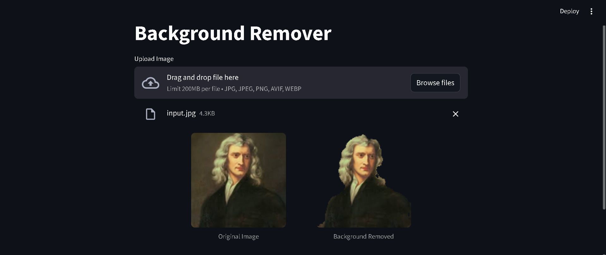

# Automatic Background Remover

## Overview

This project implements an automatic background removal system using a Deep learning fully convolutional network based on the U-Net architecture.

Given an input image, the model:

* Identifies the foreground object (person)
* Generates a segmentation mask
* Separates the subject from the background

## Working

* A regular RGB image is fed to the model
* The U-Net based model predicts a pixel-wise segmentation mask
* The mask is used to set the opacity of pixels via the alpha channel

## Objectives

* Built as a learning project to understand image segmentation in depth
* Understand and implement U-Net from scratch
* Gain hands-on experience with Tensorflow/Keras functional API for building a Computer Vision Application

## Acknowledgements

Inspired by the original U-Net architecture